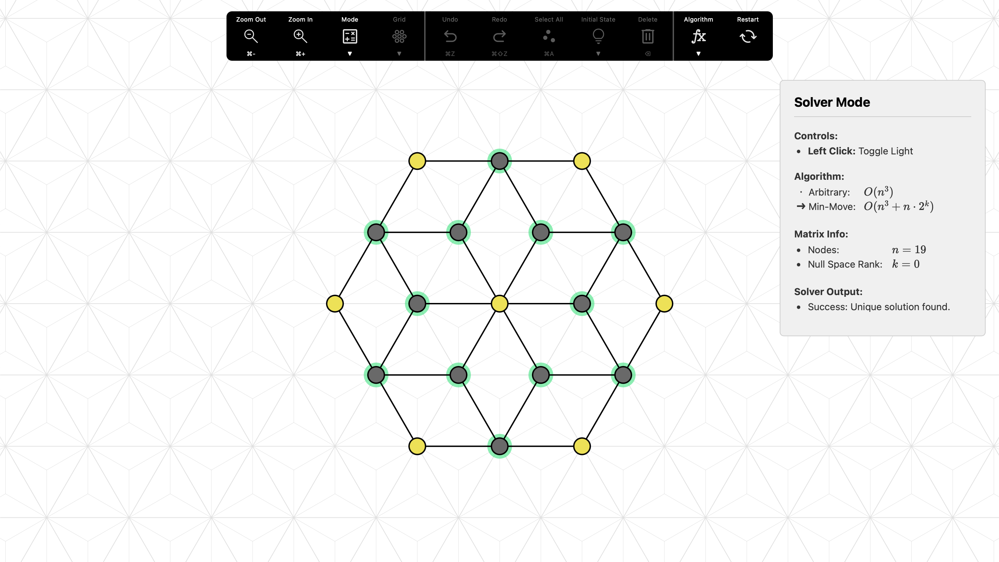

# Light Game



## How to Run

**1. Install Dependencies**
```bash
npm install
```

**2. Start Development Server**

To run the project locally with hot-reloading:
```bash
npm run dev
```

**3. Build for Production**

To generate a single, self-contained HTML file that can be opened directly in any browser:
```bash
npm run build
```
The output file will be created in the `dist` directory.