# Light Puzzle

### **1. 项目概述与愿景**

#### **1.1. 项目背景**

本项目旨在将经典的“点灯游戏”（Lights Out 游戏的变种）从固定的网格中解放出来，创建一个允许用户在任意图结构上进行游戏的网页应用。与传统目标（熄灭所有灯）不同，本项目的目标是 **点亮所有灯**。应用的核心是提供一个强大的可视化编辑器，让用户可以自由创建或在预设网格上构建节点与边的关系图，并在此基础上进行游戏。

#### **1.2.核心目标**

-   **可视化图编辑器：**  提供一个直观、易用的界面，用户可以通过简单的鼠标操作创建、连接和管理节点。
-   **双模式系统：**  清晰区分“编辑模式”用于构建图，和“游戏模式”用于实际游玩。
-   **经典游戏逻辑实现：**  在任意图结构上实现“点灯游戏”的核心反转逻辑。
-   **多布局支持：**  支持正方形网格布局和正三角形网格布局，以适应不同场景的需求。
-   **为未来拓展奠基：**  当前版本专注于用户交互和游戏本身，但其架构应为未来集成“自动求解器”等高级功能做好准备。

---

### **2. 系统核心概念定义**

-   **节点 (Node):**  图的基本单元，代表一盏灯。
    -   **属性:**  唯一 ID, 位置 (x, y), 状态 (亮/灭), 初始状态 (亮/灭), 选中状态 (是/否)。
    -   **视觉:** 节点应以圆形表示。在网格布局下，其半径应明显小于网格间距，以保证布局的清晰可辨。
-   **边 (Edge):**  连接两个节点的线，代表两个节点（灯）相邻。
    -   **属性:**  唯一 ID, 源节点 ID, 目标节点 ID, 选中状态 (是/否)。
-   **状态 (State):**
    -   **亮 (On):**  节点的激活状态，应有明确的视觉表示（例如：亮黄色、高亮）。
    -   **灭 (Off):**  节点的非激活状态，应有明确的视觉表示（例如：深灰色、暗淡）。
-   **图 (Graph):**  由一组节点和边构成的集合。
-   **画布 (Canvas):**  用户进行所有交互的主要工作区域。
-   **模式 (Mode):**  系统存在的两种主要工作状态。
    -   **编辑模式 (Edit Mode):**  用于创建和修改图的结构。
    -   **求解模式 (Solver Mode):**  用于进行“点灯游戏”并自动展示解法。

---

### **3. 全局界面布局与组件**

#### 3.1 视觉风格

所有元素的视觉风格为现代扁平设计，不要添加额外的阴影，只能使用黑白配色。

#### **3.1. 整体布局**

-   **主画布 (Main Canvas):**  占据浏览器视口的绝大部分区域，作为所有交互发生的背景。背景颜色/图案根据所选布局（见 4.3）变化。
-   **控制台 (Control Console):**
    -   **位置:**  视口中央顶部。
    -   **样式:**  黑色背景，白色文字，正方形或横向矩形。
    -   **功能:**  包含全局控制功能，如模式切换、缩放、重置等。其内容会根据当前模式动态变化。
-   **元素查看器 (Inspector Panel):**
    -   **位置:**  网页右侧，固定宽度。
    -   **功能:** 此面板的内容根据当前模式动态变化。在编辑模式下，面板会显示固定的操作提示。在求解模式下，标题为“求解模式”，并显示自动求解的结果信息。

---

### **4. 功能需求详述：编辑模式 (Edit Mode)**

**目标：**  提供灵活、强大的图构建能力。

#### **4.1. 模式激活**

-   应用加载后默认进入编辑模式，并使用正方形网格布局。
-   可从游戏模式通过控制台的模式切换按钮返回编辑模式。返回时，图中所有节点恢复到其在编辑模式下设定的外观，游戏状态（点击次数等）被丢弃。

#### 4.1. 控制台功能

控制台将始终保持一组固定的核心控件。在不同模式下，不适用的控件将被视觉上禁用（例如，变暗）且不可交互。

-   **快捷键提示:** 鼠标悬停在具有键盘快捷键的按钮上时，其 `title` 属性将显示对应的快捷键。其中，修饰键将使用简洁的符号表示（例如 `⌘` 表示 Command, `⌃` 表示 Control, `⇧` 表示 Shift）。没有快捷键的按钮则不显示提示。
-   **快捷键视觉反馈**: 当通过键盘快捷键触发一个控制台操作时，其对应的按钮将短暂地闪烁蓝色，以向用户确认操作已执行。
-   **布局与顺序:** `[模式切换] [布局切换] [缩小] [放大]` `|` `[撤销] [重做] [全选] [反转] [关灯] [删除]` `|` `[切换算法] [重新开始]`
    -   `|` 代表一个视觉分割线，用于区隔功能组。
-   **模式切换:** 一个“切换模式”按钮。当鼠标悬停在此按钮上时，其下方会竖直展开“编辑模式”和“求解模式”两个选项。
-   **布局切换:** 提供“正方形网格”和“正三角形网格”选项。如果画布上已有元素，切换布局将会清空所有元素和操作历史。此功能在 **求解模式** 下将被禁用。
-   **缩放:** “放大”和“缩小”按钮，在所有模式下均可用。
-   **撤销:** 撤销上一步编辑操作。可撤销的操作包括：创建元素、删除元素、反转节点初始状态。仅当有可撤销的操作时可用。此功能在 **求解模式** 或 **拖拽过程中** 被禁用。
-   **重做:** 重做上一步被撤销的操作。仅当有可重做的操作时可用。此功能在 **求解模式** 或 **拖拽过程中** 被禁用。
-   **全选:** 选中所有元素。仅当存在至少一个元素时可用。此功能在 **求解模式** 或 **拖拽过程中** 被禁用。
-   **反转:** 点击后反转所有选中节点的初始状态。仅当处于 **编辑模式**、**至少选中一个节点**、且**未在拖拽**时可用。
-   **关灯:** 点击后关闭所有选中节点的灯。仅当处于 **编辑模式**、**至少选中一个节点**、**至少选中一个亮着的节点**、且**未在拖拽**时可用。
-   **删除:** 点击后删除所有选中的元素。此按钮为灰黑色。仅当处于 **编辑模式**、**至少选中一个元素**、且**未在拖拽**时可用。
-   **切换算法:** 一个下拉按钮，提供两种求解策略。仅在 **求解模式** 下可用。
    -   **任意解:** 采用标准高斯消元法，快速找到问题的一个任意解。
    -   **最少操作解:** 在找到一个特解后，通过遍历解空间（k 为零空间秩）来寻找点击次数最少的解。当解空间过大时，可能只返回一个特解。
-   **重新开始:** 将解谜盘面恢复至初始状态。仅在 **求解模式** 下可用。

#### **4.2. 鼠标交互逻辑**

所有创建操作都应具备吸附功能，特别是在网格布局下。

-   **"幽灵节点" (Ghost Node) 视觉提示:**

    -   **触发:** 当鼠标在画布上移动（且未按下）时，或在拖拽过程中。
    -   **逻辑:** 系统会计算出离鼠标指针最近的有效吸附点。如果该点上没有节点，并且鼠标与该点的距离在预设半径内，就在该点上绘制一个淡灰色的圆形虚线框（“幽灵节点”）。
    -   **作用:** 此效果用于提示用户可以在何处创建新节点，无论是通过单击还是作为拖拽操作的终点。

-   **创建单个节点 (通过单击):**

    -   **触发:** 在“幽灵节点”提示框可见时，在框内区域按下鼠标左键，并在短距离内（小于拖拽阈值）松开。
    -   **逻辑:** 鼠标 **按下** 时，在该“幽灵节点”的位置立即创建一个新的真实节点，并为其注册一个临时的历史记录，以便“撤销”按钮能立刻更新。

-   **创建边 (通过拖拽):**
    -   **场景 1: 从新节点拖拽 (空白 -> 空白/已有节点):**
        -   **触发:** 在“幽灵节点”提示框可见时，按下鼠标左键并拖拽。
        -   **逻辑:**
            1.  鼠标 **按下** 时，在起始“幽灵节点”位置立即创建一个新的真实节点（节点 A）。
            2.  当拖拽距离首次超过预设阈值后，将进入“创建边”模式，**此时相关编辑操作将被锁定以防误触**：一条视觉引导线出现，从节点 A 的中心连接到鼠标指针。
            3.  当拖拽终点位于一个已有节点（节点 B）上时，引导线末端吸附到 B，同时节点 B 应显示悬停高亮效果。
            4.  当拖拽终点位于一个空白位置时，终点处会显示一个新的“幽灵节点”（节点 B 的预览），并且引导线的末端会吸附到此“幽灵节点”的中心。
            5.  鼠标 **松开** 时，如果已进入“创建边”模式，且终点是节点 B 或一个“幽灵节点”，则创建边。创建成功后，清空当前所有选择，并自动将新创建的边及其连接的两个节点（A 和 B）设为选中状态。
    -   **场景 2: 从已有节点拖拽 (已有节点 -> 空白/已有节点):**
        -   **触发:** 在一个已存在的节点（节点 A）上按下鼠标左键并拖拽。
        -   **逻辑:**
            1.  当拖拽距离首次超过预设阈值后，将进入“创建边”模式，**此时相关编辑操作将被锁定以防误触**：一条视觉引导线出现，从节点 A 的中心连接到鼠标指针。
            2.  交互逻辑与场景 1 的步骤 3、4、5 完全相同。
-   **移动画布 (Panning):**

    -   **触发:**
        -   **鼠标:** 按住 `Alt` 键 (在 macOS 上是 `Option` 键)，然后在画布任意位置按下鼠标左键并拖拽。
        -   **触控板:** 使用双指在画布上滑动。
    -   **视觉反馈:** (仅限鼠标) 鼠标指针应变为抓手形状 (`grab` / `grabbing`)。
    -   **逻辑:** 画布上的所有元素（节点、边、网格背景）会跟随鼠标或手指一同移动。此操作在 **编辑模式** 和 **求解模式** 下均可用。

-   **框选元素 (通过拖拽):**

    -   **触发:** 在画布的空白区域（即任何节点、边或“幽灵节点”之外）按下鼠标左键，并拖拽超过预设阈值。
    -   **视觉反馈:** 屏幕上会显示一个半透明的矩形选框，从拖拽起始点延伸至当前鼠标位置。
    -   **逻辑:**
        -   **默认行为:** 在画布空白区域**按下鼠标左键**以发起框选时，**UI 将立即被锁定**，且（在非多选模式下）当前所有已选中的元素会**立即被清空**。当拖拽超过预设阈值后，会出现矩形选择框。当松开鼠标左键时，所有与该矩形选框相交的节点和边都将被选中。
        -   **多选追加:** 如果在发起框选时按住 `Control` 或 `Command` 键，则不会清空已有的选择。当松开鼠标左键时，框选的元素将被追加到当前的选择集中。

-   **选中元素 (通过单击或点选):**
    -   **单选:** 在非多选模式下，单次左键点击一个节点或一条边，会取消所有其他选择，并只选中该元素。
    -   **多选:** 按住 `Control` (Windows) 或 `Command` (Mac) 键，再单击一个元素，可以将其添加至当前选择集或从当前选择集中移除（即切换其选中状态），而不会影响其他已选中的元素。
    -   **视觉反馈:** 被选中的元素，其底部会显示一个较宽的深灰色高亮框。

-   **取消选择 (通过单击):**

    -   **触发:** 在画布的空白区域（即任何节点、边或“幽灵节点”之外）单击鼠标左键（即按下并短距离内松开）。
    -   **逻辑:** 如果不是在多选模式下，此操作将取消当前任何已选中元素的选择状态。

-   **悬停与点击高亮:**
    -   **悬停高亮:** 当鼠标指针移动到一个元素上时，该元素会显示一个淡灰色的高亮框以提示其可交互。
    -   **点击高亮:** 当鼠标在元素上**按下**时，此淡灰色高亮框会保持。当鼠标**松开**（完成一次点击）后，元素会进入选中状态，并显示一个更醒目的深灰色高亮框。
-   **切换节点初始状态 (通过右键单击):**
    -   **触发:** 在一个已存在的节点上单击鼠标右键。
    -   **逻辑:** 该节点的 `initialOn` 状态会被反转（亮 ↔ 灭）。节点的视觉外观会立即更新以反映此更改。此操作不影响任何元素的选择状态。

#### 4.2.1. 交互状态转移图

为了清晰地描述左键在不同上下文中的行为，以下状态图展示了从用户按下左键到抬起的完整交互流程。此图明确了何时创建元素、何时锁定UI以及何时注册历史记录。

```mermaid
stateDiagram-v2
    direction LR

    [*] --> 空闲

    state " " as T1
    空闲 --> T1: 在"幽灵节点"上左键按下
    T1 --> 按下_幽灵节点
    note right of T1
        <b>动作:</b>
        - 创建新节点 A
        - <b>(非多选模式)</b> 清空选择, 仅选中节点 A
        - <b>(多选模式)</b> 将节点 A 添加到选择集
        - 注册临时的"创建节点"历史记录
        - UI 未锁定
    end note
    
    state " " as T2
    空闲 --> T2: 在"已有节点"上左键按下
    T2 --> 按下_已有节点
    note right of T2
        <b>动作:</b>
        - <b>(非多选模式)</b> 清空选择, 仅选中节点 A
        - <b>(多选模式)</b> 切换节点 A 的选中状态
        - 记录起始节点 A
        - 无历史记录变更
        - UI 未锁定
    end note
    
    state " " as T3
    空闲 --> T3: 在"空白区域"上左键按下
    T3 --> 锁定_框选
    note right of T3
        <b>动作:</b>
        - UI 锁定
        - <b>(非多选模式)</b> 清空当前所有选择
    end note

    state "已按下 (在幽灵节点上)" as 按下_幽灵节点
    state "已按下 (在已有节点上)" as 按下_已有节点
    state "已锁定 (准备框选)" as 锁定_框选
    state "拖拽中 (从新节点开始)" as 拖拽中_自新节点
    state "拖拽中 (从已有节点开始)" as 拖拽中_自已有节点
    state "拖拽中 (框选)" as 拖拽中_框选

    state " " as T4
    按下_幽灵节点 --> T4: 移动超过阈值
    T4 --> 拖拽中_自新节点
    note right of T4
        <b>动作:</b> 
        - UI 锁定
    end note
    note right of 拖拽中_自新节点
        <b>视觉:</b> 
        - 绘制拖拽引导线
        - 提供悬浮节点、（不需要高亮悬浮边）、幽灵节点的高亮提示
    end note
    
    state " " as T5
    按下_幽灵节点 --> T5: 左键抬起
    T5 --> 空闲
    note right of T5
        <b>动作 (完成节点创建):</b>
        - 提交"创建节点"历史记录
    end note

    state " " as T6
    按下_已有节点 --> T6: 移动超过阈值
    T6 --> 拖拽中_自已有节点
    note right of T6
        <b>动作:</b> 
        - UI 锁定
        - <b>(多选模式)</b> 如果此前因为多选模式取消选中了A的选中，则再次添加A到选择集
    end note
    note right of 拖拽中_自已有节点
        <b>视觉:</b> 
        - 绘制拖拽引导线
        - 提供悬浮节点、（不需要高亮悬浮边）、幽灵节点的高亮提示
    end note
    
    state " " as T7
    按下_已有节点 --> T7: 左键抬起
    T7 --> 空闲
    note right of T7
        <b>动作 (完成点选):</b>
        - 无额外操作 (选择已在按下时更新)
    end note

    state " " as T8
    锁定_框选 --> T8: 移动超过阈值
    T8 --> 拖拽中_框选
    note right of T8
        <b>动作:</b> 
        - UI 已锁定
    end note
    note right of 拖拽中_框选
        <b>视觉:</b> 
        - 绘制选择框
        - 提供与框相交的节点、边的高亮显示
    end note
    
    state " " as T9
    锁定_框选 --> T9: 左键抬起
    T9 --> 空闲
    note right of T9
        <b>动作 (完成空白区域单击):</b>
        - (非多选模式) 取消所有选择
    end note

    state " " as T10
    拖拽中_自新节点 --> T10: 左键抬起
    T10 --> 空闲
    note right of T10
        <b>动作 (完成拖拽):</b>
        - <b>(终点没有节点)</b> 仅提交“创建节点”的历史记录
        - <b>(终点为幽灵节点)</b> 创建新节点 B
        - <b>(终点为已有节点)</b> 使用现有节点 B
        - 创建从 A 到 B 的边
        - 合并"创建节点A"与"创建边"的历史
        - <b>(非多选模式)</b> 清空选择, 并选中 A, B 及新创建的边
        - <b>(多选模式)</b> 添加 A, B 及新创建的边到选择集
    end note

    state " " as T11
    拖拽中_自已有节点 --> T11: 左键抬起
    T11 --> 空闲
    note right of T11
        <b>动作 (完成拖拽):</b>
        - <b>(终点没有节点)</b> 无操作
        - <b>(终点为幽灵节点)</b> 创建新节点 B
        - <b>(终点为已有节点)</b> 使用现有节点 B
        - 创建从 A 到 B 的边
        - 注册"创建边"历史记录
        - <b>(非多选模式)</b> 清空选择, 并选中 A, B 及新创建的边
        - <b>(多选模式)</b> 添加 A, B 及新创建的边到选择集
    end note

    state " " as T12
    拖拽中_框选 --> T12: 左键抬起
    T12 --> 空闲
    note right of T12
        <b>动作 (完成框选):</b>
        - <b>(非多选模式)</b> 选中框内所有元素
        - <b>(多选模式)</b> 将框内所有元素添加到选择集
    end note

    note left of 空闲
        <b>视觉:</b>
        - 提供悬浮节点、悬浮边、幽灵节点的高亮提示
    end note
```

#### 4.3. 布局与画布背景

用户可以通过控制台的按钮或下拉菜单切换画布布局。由于不同布局的吸附格点不兼容，如果画布上已有元素，切换布局会清空当前画布上的所有元素和操作历史。

-   **1. 正方形网格画布 (Square Grid):**
    -   **背景:**  绘制由淡灰色细线构成的正方形网格。在每个正方形内，使用更细的淡灰色线绘制对角线。
    -   **行为:**  所有新创建的节点，其位置将被自动吸附到最近的正方形顶点或其对角线的交点（即正方形的中心）。
-   **2. 正三角形网格画布 (Triangular Grid):**
    -   **背景:**  绘制由淡灰色细线构成的等边三角形网格。在每个三角形内部，使用更细的淡灰色线从三个顶点向其中心点绘制连线。
    -   **行为:**  所有新创建的节点，其位置将被自动吸附到最近的三角形顶点或其中心点。

#### **4.4. 元素查看器与操作**

在编辑模式下，元素查看器会显示以下内容：

-   **操作提示 (Controls):**
    -   **单击左键：** 添加节点
    -   **拖拽左键：** 添加边
    -   **反转节点初始状态：** 单击右键
-   **数据操作 (Data):**
    -   一个 "Import" 按钮，用于触发导入流程。
    -   一个 "Export" 按钮，用于触发导出流程。

#### 4.5. 键盘快捷键

-   **Backspace / Delete:** 当一个或多个元素被选中时，按下此键可将其全部删除。
-   **Escape (Esc):** 当一个或多个元素被选中时，按下此键可取消所有选择。
-   **`Control` / `Command` + `Z`:** 撤销上一步操作。
-   **`Control` / `Command` + `Shift` + `Z`:** 重做上一步操作。
-   **`Control` / `Command` + `+`:** 放大画布。
-   **`Control` / `Command` + `-`:** 缩小画布。

#### 4.6. 导入与导出

系统支持通过 Base64 编码的文本字符串来导入和导出图的完整状态。此功能通过一个覆盖全屏的模态对话框进行操作，以提供专注的交互体验。

-   **触发:** 在编辑模式下，右侧查看器面板会提供 "Import" 和 "Export" 两个按钮。

-   **导出 (Export):**
    -   **触发:** 点击查看器中的 "Export" 按钮。
    -   **逻辑:**
        1.  应用界面将被虚化并锁定交互，同时一个模态框会显示在屏幕中央。
        2.  模态框内会显示一个文本区域，其中包含当前图结构序列化后的 Base64 字符串。
        3.  该字符串内容默认为全选状态，方便用户手动复制。
        4.  模态框通过点击背景来关闭。

-   **导入 (Import):**
    -   **触发:** 点击查看器中的 "Import" 按钮。
    -   **逻辑:**
        1.  应用界面将被虚化并锁定交互，同时一个模态框会显示在屏幕中央。
        2.  模态框内会纵向排列一个文本输入框和一个 "Import" 按钮。
        3.  用户将之前导出的 Base64 字符串粘贴到输入框中，并点击模态框内的 "Import" 按钮。
        4.  点击后，当前画布上的所有元素和操作历史将被清空，系统会根据输入的字符串重新构建图，并关闭模态框。
        5.  如果输入的字符串格式无效或为空，会显示错误提示。
        6.  模态框同样提供关闭机制。

---

### **5. 功能需求详述：求解模式 (Solver Mode)**

**目标：** 提供流畅、带有即时求解提示的游戏体验。

#### **5.1. 模式激活与状态转换**

-   **触发:**  在编辑模式下，点击控制台中的“进入求解模式”按钮。
-   **逻辑:**
    1.  **锁定图结构:**  禁用所有节点的移动、创建和删除功能，以及边的创建和删除功能。
    2.  **计算并显示矩阵信息:** 系统立即基于图结构计算出节点数量 `n` 和零空间秩 `k`，并将其更新到右侧的元素查看器中。
    3.  **异步求解:** 在显示矩阵信息后，系统会异步启动求解过程。
        -   首先，将盘面恢复到初始状态。
        -   然后，根据用户选择的算法进行求解，求解完成后，将结果（高亮节点和提示信息）更新到界面上。

#### **5.2. 核心交互**

-   **触发:**  在求解模式下，用鼠标左键点击任意一个节点。
-   **逻辑:**
    1.  被点击的节点自身的状态发生一次反转（亮 → 灭，灭 → 亮）。
    2.  所有通过边与该节点直接相邻的节点，其状态也各发生一次反转。
    3.  **求解提示更新:**
        -   如果被点击的节点 **是** 一个被绿色高亮标记的节点，则其高亮状态被移除，表示玩家完成了一步建议操作。
        -   如果被点击的节点 **不是** 一个被绿色高亮标记的节点，表示玩家偏离了建议解法。系统会基于新的盘面状态，立即重新计算并展示新的最优解法。

#### **5.3. 游戏控制**

-   **重新开始 (Restart):**
    -   **触发:**  点击控制台中的“重新开始”按钮。
    -   **逻辑:**  所有节点的状态恢复到进入求解模式时所记录的“开局盘面”，并重新计算和显示初始解法。
-   **返回编辑:**
    -   **触发:** 点击控制台的“返回编辑”按钮。
    -   **逻辑:** 退出求解模式，丢弃当前游戏进度。

#### **5.4. 元素查看器**

在求解模式下，元素查看器会显示以下内容：

-   **操作提示：**
    -   单击左键：点灯
-   **求解算法：**
    -   此处会显示当前激活的求解算法及其复杂度。选中的算法会用 `➔` 标记，未选中的用 `·` 标记，以保证对齐。例如：
        -   `➔ 任意解 O(n³)`
        -   `· 最少操作解 O(n³ + n·2ᵏ)`
-   **矩阵信息：**
    -   节点数量 n = [数值]
    -   零空间秩 k = [数值]
-   **求解输出：**
    -   此处会显示求解结果，例如“求解成功，问题有解”或“求解失败，问题无解”。

#### **5.5. 求解功能实现指导**

-   该问题可被建模为一个在有限域 \(F_2\) 上的线性方程组求解问题 \(Ax = b\)。
    -   **`A` (影响矩阵):** 这是一个 N x N 的方阵 (N 为节点总数)，是图的邻接矩阵与单位矩阵 `I` 的和。
    -   **`b` (目标状态向量):** 这是一个 N x 1 的列向量，代表从 **当前状态** 达到目标状态（全亮）所需的状态变化。如果一个灯当前为“灭”（状态 0），它需要被翻转，因此 `b` 中对应元素为 1。如果灯当前为“亮”（状态 1），则不需要翻转，对应元素为 0。
    -   **`x` (解向量):** 待求解的 N x 1 向量，`x[j]=1` 表示需要点击节点 `j`。
-   **求解算法:**
    -   **获取矩阵信息:** 求解器首先对矩阵 `A` 进行高斯消元，得到其秩 `rank(A)`。节点数量 `n` 即为 `N`，零空间秩 `k` 为 `n - rank(A)`。此过程独立于求解，会在进入求解模式时立即执行并显示结果。
    -   **任意解:** 直接从高斯消元的增广矩阵结果中回代，得到一个特解 `x_p`。
    -   **最少操作解:** 当 `k > 0` 时，问题有多个解。求解器首先找到一个特解 `x_p`，然后计算出 `A` 的零空间的一组基（共 `k` 个向量）。通过遍历特解与零空间基向量的所有 `2^k` 种线性组合，找到“汉明权重”（即解向量中‘1’的个数）最小的解。

---

### **6. 未来拓展规划**

本文档描述的功能为项目的第一阶段。以下功能被预留作未来迭代：

- 让正方形网格横过来/竖过来

---

### **7. 代码指导 (Code Guide)**

本节为项目的开发人员提供代码层面的指导原则，旨在确保代码库的一致性、可读性和可维护性。

#### **7.2. 注释风格**

-   **JSDoc 标准:** 所有文件、类和公共方法都必须使用 JSDoc 格式进行注释。
-   **文件级注释:** 每个 `.js` 文件都必须在文件顶部包含一个 `/** @file ... @description ... */` 块，清晰地说明该文件的用途和在系统中的角色。
-   **函数/方法注释:** 所有非私有的函数和方法都必须有一个 JSDoc 块，描述其功能、参数 (`@param`) 和返回值 (`@returns`)。复杂的类型应使用 `@typedef` 定义。
-   **拒绝“废话”注释:** 严禁添加那些仅仅是重复代码逻辑的行内注释 (`//`)。注释的目的是解释 **“为什么”** 这么做，而不是 **“做了什么”**，或是阐明一段特别复杂、不直观的算法。

#### **7.3. git工作流**

- 本项目在本地维护两个分支：`main` 和 `local`，在 `local` 上进行本地开发，并在发布项目时通过 merge squash 合并到 `main` 分支上推送到远程。
- 出现冲突时，全部采用 local 分支的修改的指令：`git merge --squash -X theirs local`。
- local-document.md 应当出现在 `main` 分支的 `.gitignore` 文件中，不推送到远程。

---
